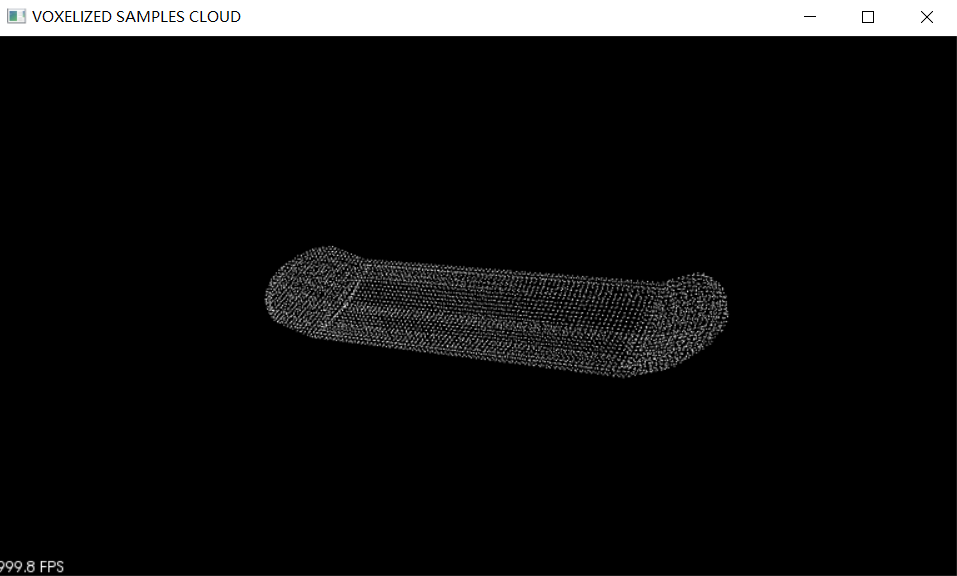
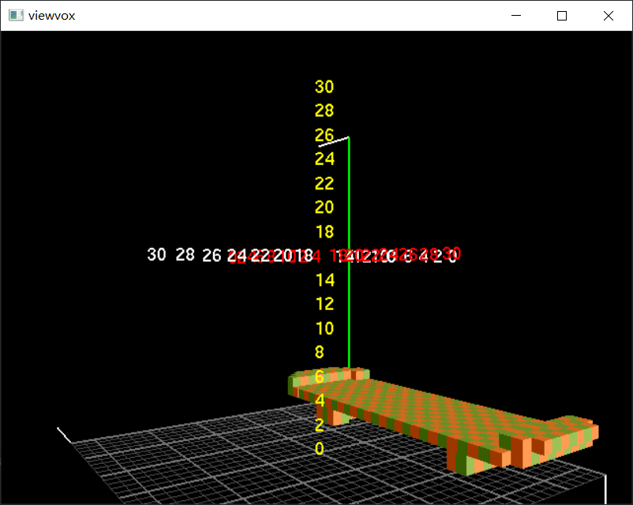
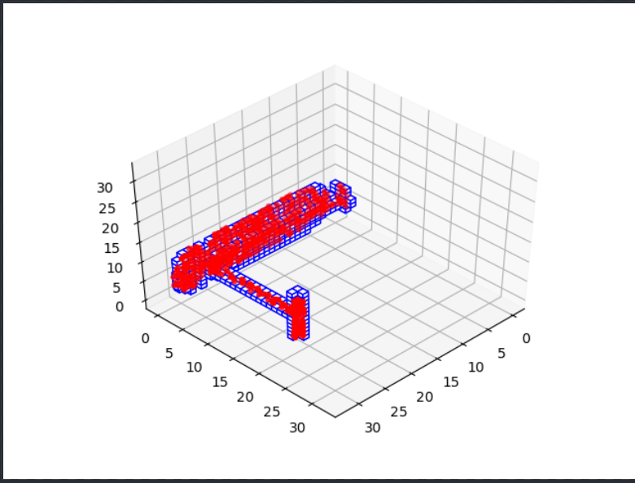
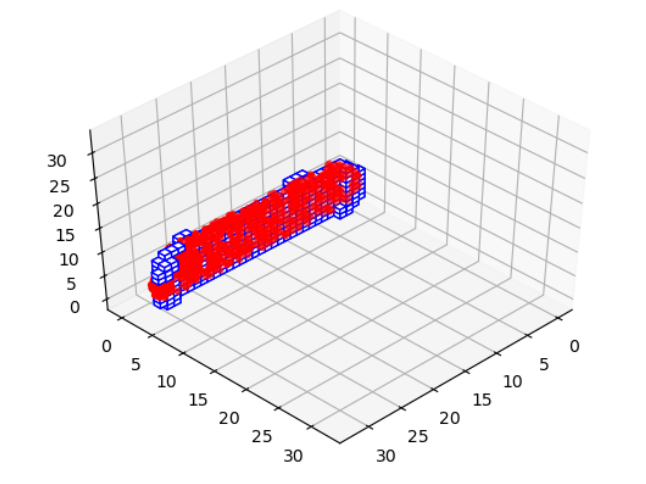

# Planar Reflective Symmetry

##  1. Get Datasets

```
# shapnet
https://www.shapenet.org/download/shapenetcore

# download a synset
http://shapenet.cs.stanford.edu/shapenet/obj-zip/<synsetId>.zip
id = 04225987 # skateboard
```
- reflection plane
$$
a_ix+b_iy+c_iz+d_i=0
$$
- quaternion
$$
r_{i0}+r_{i1}\bold{i}+r_{i2}\bold{j}+r_{i3}\bold{k}\\
i^2=j^2=k^2=-1\\
ij=k、ji=-k、jk=i、kj=-i、ki=j、ik=-j
$$

## 2. Data Processing

- PCL_mesh_sampling

  

  PCL采样不均匀，无法采集完成1000个点，有遗漏

- binvox
  
  将obj转为32\*32\*32的体素，.nrrd格式

- viewvox







## 3. Build Network


Reference：

1. [pytorch入门](https://pytorch.org/tutorials/beginner/blitz/tensor_tutorial.html#sphx-glr-beginner-blitz-tensor-tutorial-py)
2. [binvox使用](https://web.archive.org/web/20131213132022/https://minecraft.gamepedia.com/Binvox)

